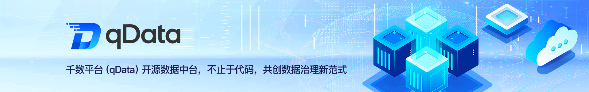

  
 
 
 
 

 
 

  📖简体中文 | <a href="README.en.md">📖English</a>

## 🌈 平台简介
**qData 数据中台**是一套集**数据集成**、**标准管理**、**资产治理**、**质量控制**、**服务开放**与**智能分析**于一体的企业级数据管理平台，致力于帮助企业实现数据资源的统一管理、高效治理与价值释放。我们秉承“高效、安全、灵活、开放”的理念，持续引入前沿技术，让数据真正成为企业发展的核心驱动力。

✨✨✨**在线文档**✨✨✨ <a href="https://qdata.qiantong.tech" target="_blank">https://qdata.qiantong.tech</a> 

✨✨✨**开源版演示地址**✨✨✨ <a href="https://qdata-demo.qiantong.tech" target="_blank">https://qdata-demo.qiantong.tech</a> ，账号：qData 密码：qData123

✨✨✨**商业版演示地址**✨✨✨ <a href="https://qdata-pro.qiantong.tech" target="_blank">https://qdata-pro.qiantong.tech</a> ，演示账号请 [联系客服获取](https://qdata.qiantong.tech/business.html)

> 如果 qData 对您有帮助，请点个 **Star ⭐️**，这是我们持续更新的最大动力！ 🚀

## 🍱 使用场景

适用于希望通过整合、治理和分析多源数据，打破孤岛、提升质量与效率，实现数据驱动与业务创新的大型企业、中小企业与政府机构。

| 场景          | 描述                            | 典型客户类型             |
| ----------- | ----------------------------- | ------------------ |
| **数据整合治理**  | 需要汇聚并统一管理来自不同系统、数据库及外部合作方的数据。 | 政府机构、大型集团、科研院校     |
| **质量与效率提升** | 面临数据质量不佳、处理效率低下，影响业务分析与应用。    | 金融机构、制造企业、互联网企业    |
| **打破数据孤岛**  | 多个独立系统各自为政，数据无法流通共享，业务协同受限。   | 集团企业、公共服务机构、智慧城市项目 |
| **决策与创新驱动** | 希望通过数据分析支撑战略决策，并挖掘数据价值驱动业务创新。 | 企业管理层、产品创新团队、研究机构  |
| **数字化转型支撑** | 正在推进或计划开展数字化转型的企业或政府机构。       | 政府部门、国企、成长型中小企业    |

## 💡 优势

| 优势点           | 描述                             |
| ------------- | ------------------------------ |
| **高效数据集成**    | 数据集成模块对标 **Kettle**，兼容性强，迁移与使用成本更低。       |
| **全生命周期覆盖**   | 覆盖数据采集、治理、建模、共享服务，支持完整的端到端业务闭环。     |
| **轻量部署，弹性扩展** | 默认单体架构，简单易用；可快速切换微服务模式，满足横向扩展的需求。     |
| **高性能处理**     | 单节点即可支撑千万级/分钟数据处理，性能强劲。        |
| **批流一体，多引擎**  | 同时支持批处理与流处理，兼容多种执行引擎，实现不同场景下的数据处理需求一体化。          |
| **全类型数据资产管理** | 支持结构化与非结构化数据的统一管理，资产清晰可视。         |
| **数据质量合规**    | 符合 **GB/T 36344** 国家标准，确保数据准确、完整、一致并满足合规要求。   |
| **开发生产一体化**   | 任务配置可跨开发、测试和生产环境复用，简化运维流程。         |
| **开源友好体验**    | 开箱即用，支持快速部署与示例引导，上手门槛低，社区活跃。          |
| **商业版平滑升级**   | 先使用开源版进行探索与验证，复杂需求可平滑过渡至商业版，获得全链路保障。 |

## ✅ 已有功能一览

| 模块   | 描述                                                                                        |
|------|-------------------------------------------------------------------------------------------|
| 数据集成（ETL） | 支持数据库、文件、消息队列等多种数据源的**无缝接入**，提供**直观的ETL设计界面**、多任务调度与实时监控，并内置**丰富的**数据清洗规则。对标 **Kettle**，以**更低的使用成本**助力数据流转。  |
| 数据资产 | 数据资产管理通过目录结构对数据资产进行**精细化**分级分类，覆盖从创建到销毁的全**生命周期**管理，确保每一份数据都得到妥善处理，提升资产可见可控性。                     |
| 数据服务 | 数据服务管理模块负责将数据资产封装为**API服务**，支持外部API接口转发，并包含全面的日志管理、数据脱敏、数据接口和服务接口管理及其调用日志监控，实现数据服务能力标准化与可管可控。 |
| 数据标准 | 数据标准管理涉及逻辑模型（表级关联数据元）和数据元模型（字段级绑定规范、稽查与清洗），为结构化数据制**定统一标准**，并确保其质量达到企业级要求。                    |
| 数据质量 | 数据质量管理利用预置的稽查规则和数据清洗规则，对数据的准确性、一致性、完整性进行自动化校验与修正，确保数据始终处于最佳状态，满足高质量治理需求。                  |
| 元数据管理 | 元数据管理模块集中管理数据表、字段、稽查、清洗指标等元信息，构建统一的数据资产目录，为用户提供便捷的数据查找途径，支持深入的数据血缘分析和结构维护。                |
| 标签管理 | 统一标签管理支持自动生成多维度标签，并提供强大的筛选能力，使数据分类与精准检索变得轻而易举，提升数据使用效率与业务响应速度。                            |
| 数据开发 | 数据开发模块支持达梦8、MySQL、Oracle、人大金仓等主流数据库的任务开发，结合SQL及大数据脚本，根据业务需求灵活加工和处理数据，支撑复杂业务场景下的数据建模与计算。   |
| 数据查询 | 数据查询模块提供灵活且高效的交互式查询工具，让用户能够迅速分析和挖掘结构化数据中的深层价值，提升数据探索与决策辅助能力。                              |
| 系统管理 | 系统管理涵盖系统配置、用户与权限管理、运行监控、日志管理和服务器资源监控等核心功能，同时提供工作空间管理，实现任务在不同项目组间的高效拆分与协作，适应前店后厂式组织流程。     |

👉 qData 数据中台采用模块化设计，涵盖12大核心功能模块。**最新完整版**功能清单参见：[qData 功能清单总览](https://qdata.qiantong.tech/docs/start/features.html)

## 🚧 未来开发计划

| 功能名称           | 功能描述                                                                                           |
|--------------------|--------------------------------------------------------------------------------------------------|
| 数据集成（增强）   | 支持异构数据源、文件、接口及网络爬虫的统一采集与同步，扩展数据转换类型与接入方式，提升多源异构数据整合能力，满足企业多样化数据集成需求。 |
| 作业调度中心       | 实现任务编排、依赖管理、定时执行、失败重试、日志追踪等核心调度能力，全面提升任务执行的自动化水平与流程可控性。适用于复杂任务流的统一调度与集中管理。 |
| 数据血缘分析       | 支持字段级血缘追踪与图谱化展示，全面梳理数据流转路径与依赖关系，帮助用户清晰理解数据来源与流向，提升数据可追溯性与治理精准度。 |
| 数据图谱管理       | 基于数据仓库构建业务实体、事实表与维度表之间的图谱关系，支持多层级模型梳理与可视化展示，增强对数据逻辑结构与业务依赖的理解与管理能力。 |
| 实时数据开发       | 基于 Flink、Kafka 等流处理引擎构建实时任务开发能力，支持低延迟数据处理与动态指标计算，适用于实时监控、预警推送与事件驱动型业务场景。 |
| 数据质量管理（增强） | 基于规则引擎实现数据质量检测机制，支持质量报告生成与指标统计分析，自动识别数据准确性、完整性、一致性问题，助力企业构建高质量数据治理体系。 |
| 数据比对管理       | 支持数据库连接配置与任务调度，自动执行结构与内容比对任务，生成比对日志，有效验证跨源数据一致性，提升数据校验效率与问题排查能力。 |
| 元数据管理（扩展） | 扩展字段级元数据、数据地图、SQL 控制台与变更记录等能力，逐步构建数据血缘分析、影响分析与结构可视化体系，提升数据资产可维护性与治理透明度。 |
| 离线数据开发       | 支持基于 Spark、Hive、SQL 等任务类型的离线数据处理，适用于大规模数据的周期性加工与分析，提供统一的作业管理入口与执行调度机制，提升批量处理效率与稳定性。 |
| 数据可视化         | 提供 BI 报表、数据看板、大屏展示等多种可视化能力，支持拖拽式配置、权限控制与图表联动，助力业务人员快速洞察数据价值。 |
| AI 辅助开发与治理  | 引入 AI 技术，支持离线与实时数据开发中的 SQL 智能补全、自动优化、异常检测与调试辅助，显著提升开发效率、代码质量与问题响应能力。 |

💡 如您有好的建议或功能需求，欢迎 [提交Issue](https://gitee.com/qiantongtech/qData/issues)，与我们共同完善数据中台功能。

[//]: # (## 🧩 架构图)

[//]: # (![framework.png]&#40;images%2Fframework.png&#41;)

## 🛠️ 技术栈
qData 平台采用前后端分离架构，后端基于 Spring Boot，前端基于 Vue 3，并整合了部分主流中间件与数据工具。

<table>
  <tr>
    <th>分类</th><th>技术</th><th>描述</th>
  </tr>
  <tr>
    <td rowspan="6">后端技术栈</td><td>Spring Boot</td><td>提供快速开发能力</td>
  </tr>
  <tr>
    <td>Spring Security</td><td>实现用户权限认证与控制</td>
  </tr>
  <tr>
    <td>MySQL、PostgreSQL、达梦8、人大金仓</td><td>持久化存储与配置管理</td>
  </tr>
  <tr>
    <td>MyBatis-Plus</td><td>简化数据库操作</td>
  </tr>
  <tr>
    <td>Redis</td><td>支持缓存、分布式锁等</td>
  </tr>
  <tr>
    <td>RabbitMQ</td><td>实现异步通信与解耦处理</td>
  </tr>

  <tr>
    <td rowspan="3">前端技术栈</td><td>Vue 3</td><td>现代化响应式框架</td>
  </tr>
  <tr>
    <td>Element UI</td><td>常用 UI 组件支持</td>
  </tr>
  <tr>
    <td>Vite</td><td>快速开发与构建工具</td>
  </tr>

  <tr>
    <td rowspan="4">第三方依赖</td><td>DolphinScheduler</td><td>提供可视化任务编排、依赖管理及调度能力</td>
  </tr>
  <tr>
    <td>Spark</td><td>批流一体，支持 ETL 数据处理</td>
  </tr>
  <tr>
    <td>Hive</td><td>支持数据建模、分区管理及元数据维护</td>
  </tr>
  <tr>
    <td>Hive、HBase</td><td>支持海量非结构化与半结构化数据存储</td>
  </tr>
</table>

## 🏗️ 部署要求

在部署 qData 之前，请确保以下环境和工具已正确安装：

<table>
  <tr>
    <th>环境</th><th>项目</th><th>推荐版本</th><th>说明</th>
  </tr>
  <tr>
    <td rowspan="6">后端</td><td>JDK</td><td>1.8 或以上</td><td>建议使用 OpenJDK 8 或 11</td>
  </tr>
  <tr>
    <td>Maven</td><td>3.6+</td><td>项目构建与依赖管理</td>
  </tr>
  <tr>
    <td>达梦8</td><td>8.0</td><td>关系型数据库（可切至MySQL）</td>
  </tr>
  <tr>
    <td>Redis</td><td>5.0+</td><td>缓存与消息功能支持</td>
  </tr>
  <tr>
    <td>RabbitMQ</td><td>可选</td><td>用于任务调度、异步通信等功能</td>
  </tr>
  <tr>
    <td>操作系统</td><td>Windows / Linux / Mac</td><td>通用环境均可运行</td>
  </tr>

  <tr>
    <td rowspan="3">前端</td><td>Node.js</td><td>16+</td><td>构建工具依赖</td>
  </tr>
  <tr>
    <td>npm</td><td>10+</td><td>包管理器</td>
  </tr>
  <tr>
    <td>Vite</td><td>最新版</td><td>脚手架工具</td>
  </tr>
</table>

## 🚨 商用授权

qData 提供 **商业版** 与 **开源版** 两种形态，满足不同规模与场景下的用户需求。两者既各具特色，又形成互补：开源版更像启蒙老师，帮助低成本起步；商业版更像专家顾问，提供深度与保障。无论选择哪种版本，qData 都将成为可靠的伙伴，帮助企业释放数据价值，加速数字化进程。

👉 如需 **开源版品牌授权** 或 **咨询商业版**，请点击按钮查看详情：[💼 了解授权详情](https://qdata.qiantong.tech/business.html)

## 🚀 快速开始

| 部署方式                    | 说明                                                              | 适用场景               |
| ----------------------- | --------------------------------------------------------------- | ------------------ |
| [Docker Compose 部署](https://qdata.qiantong.tech/docs/deploy/docker-compose-deployment.html) | 所有组件（调度器、数据库、消息队列、Spark、Flink 等）以及 qData 数据中台源码都通过 Docker Compose 一键启动 | **初学者快速上手**、功能演示、测试环境  |
| [使用源代码本地启动](https://qdata.qiantong.tech/docs/deploy/build-from-source.html)  | qData 数据中台源码由开发者本地运行，依赖组件通过 Docker Compose 启动  | **日常开发**、功能联调          |
| [自主部署（纯手工安装）](https://qdata.qiantong.tech/docs/deploy/manual-deployment/)  | 所有依赖组件及 qData 数据中台服务均需手工安装和配置  | **生产环境**、大规模部署、个性化定制场景 |

👉 查看完整的安装与部署指南：<a href="https://qdata.qiantong.tech/docs/deploy/deploy-open-source.html">🧭 点击查看详细部署步骤</a>

## 👥 QQ交流群
欢迎加入 qData 官方 QQ 交流群，获取最新动态、技术支持与使用交流。

👉 <a href="https://qdata.qiantong.tech/discuss.html">点击加入 QQ 交流群</a>

<!-- 

 -->

## 🖼️ 系统配图
<table>
    <tr>
        <td>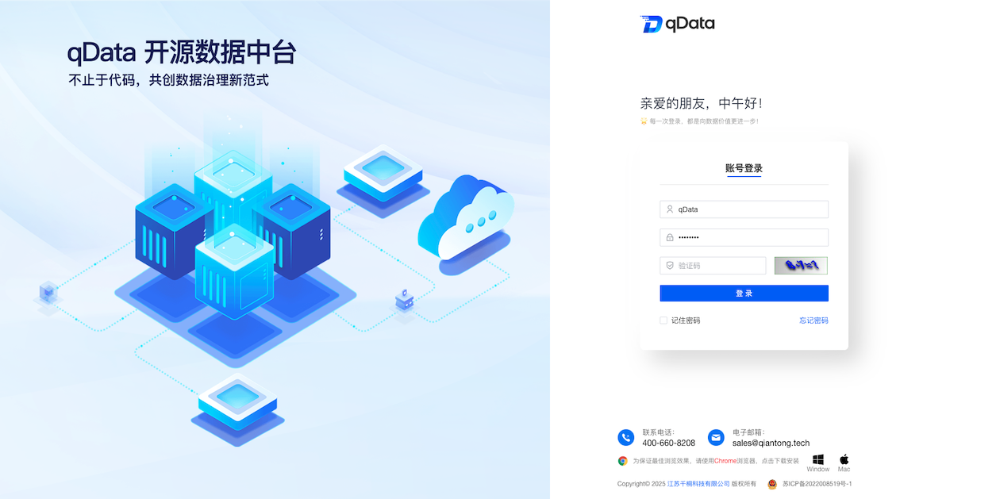</td>
        <td>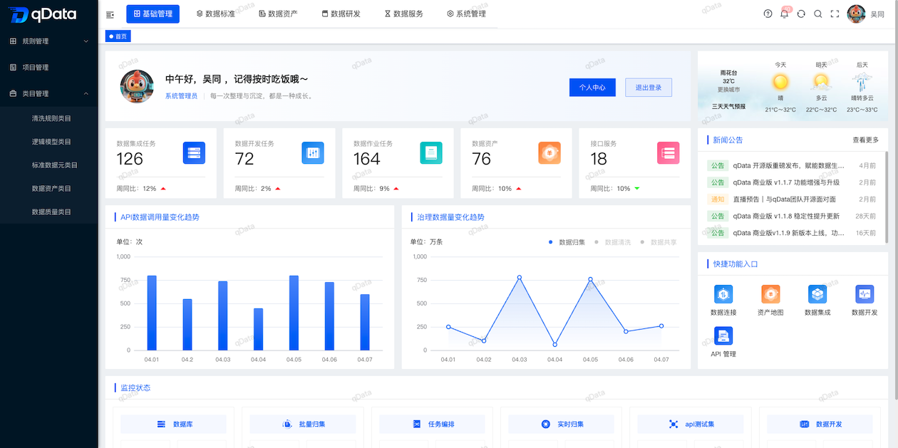</td>
    </tr>
    <tr>
        <td>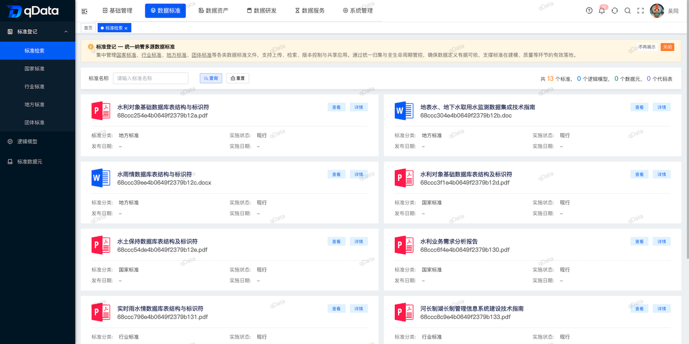</td>
        <td>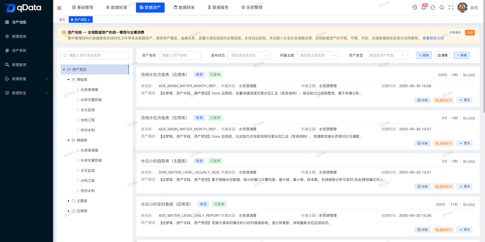</td>
    </tr>
    <tr>
        <td>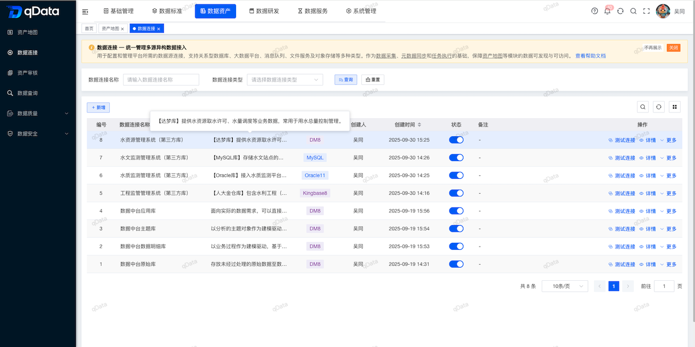</td>
        <td>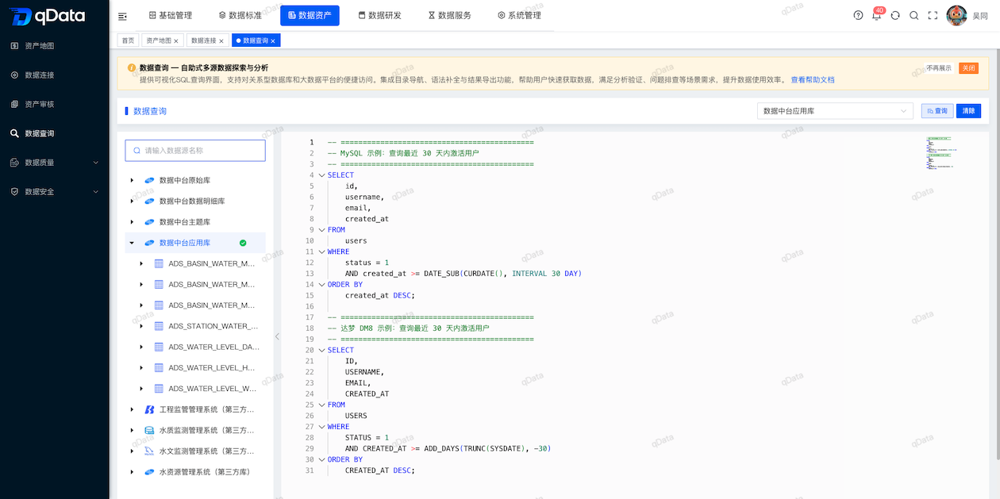</td>
    </tr>
    <tr>
        <td>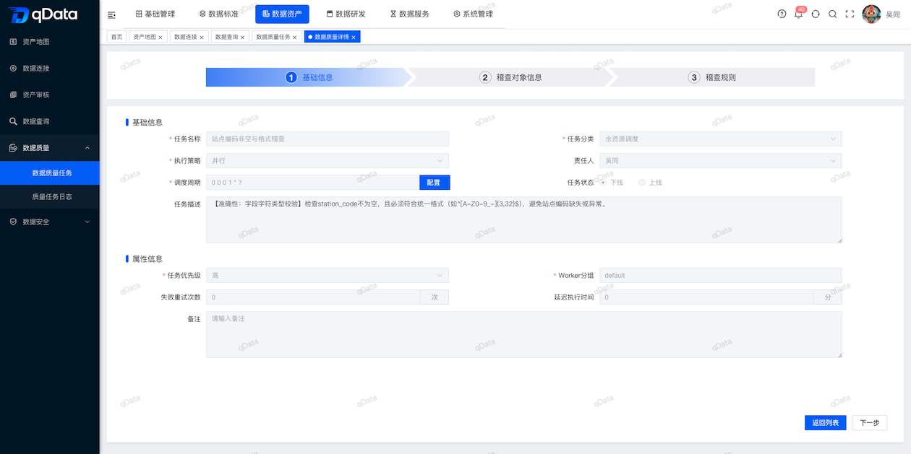</td>
        <td>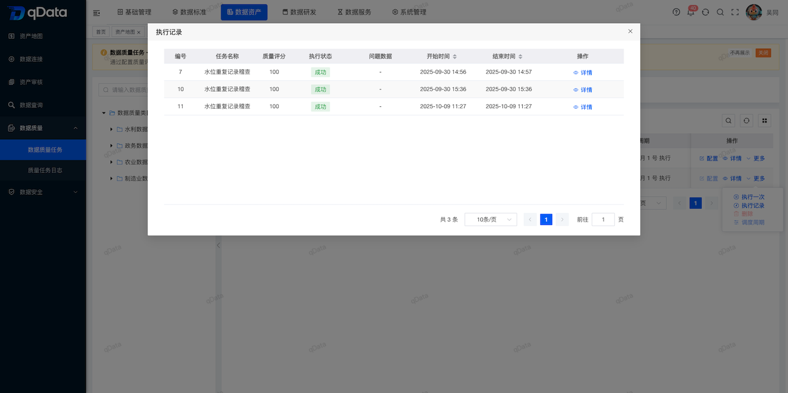</td>
    </tr>
    <tr>
        <td>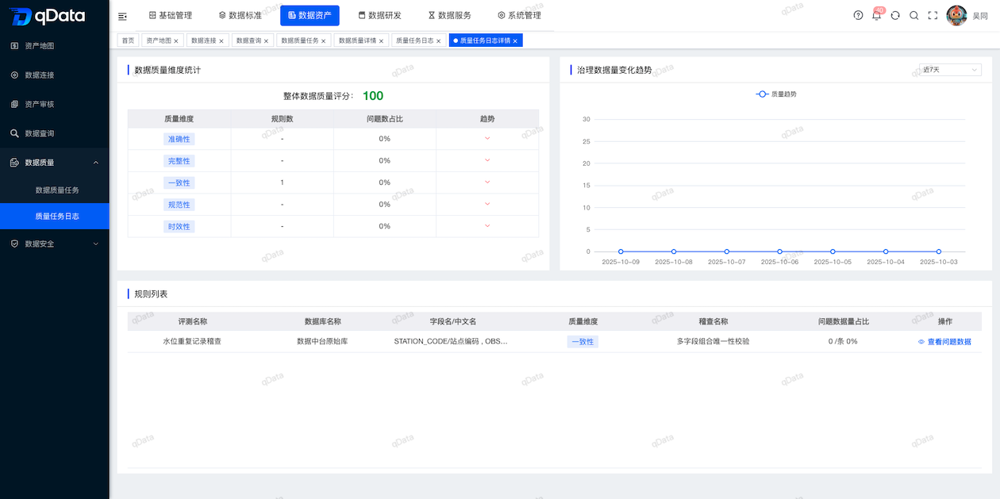</td>
        <td>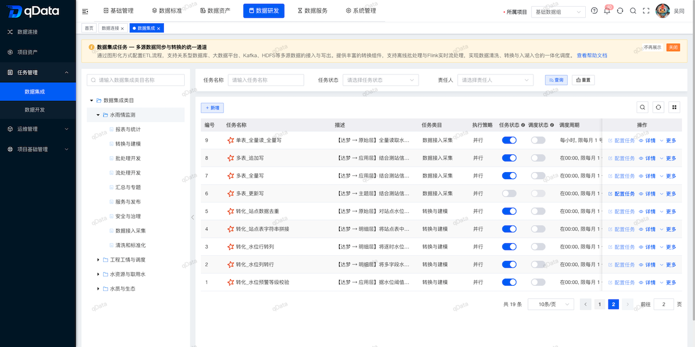</td>
    </tr>
    <tr>
        <td></td>
        <td>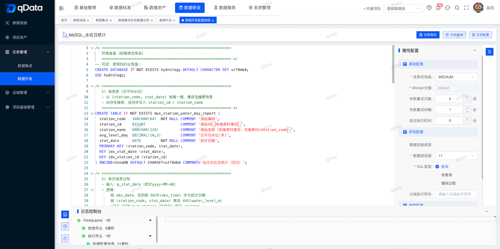</td>
    </tr>
    <tr>
        <td>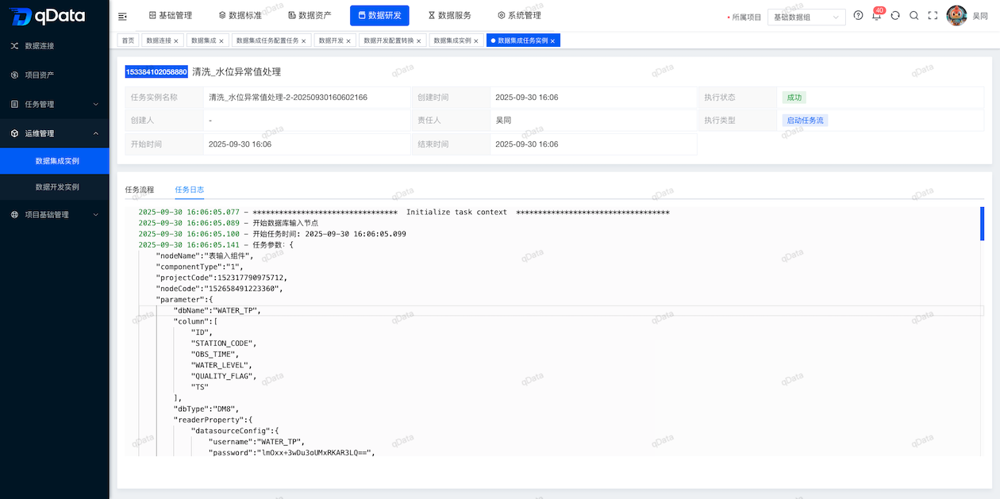</td>
        <td>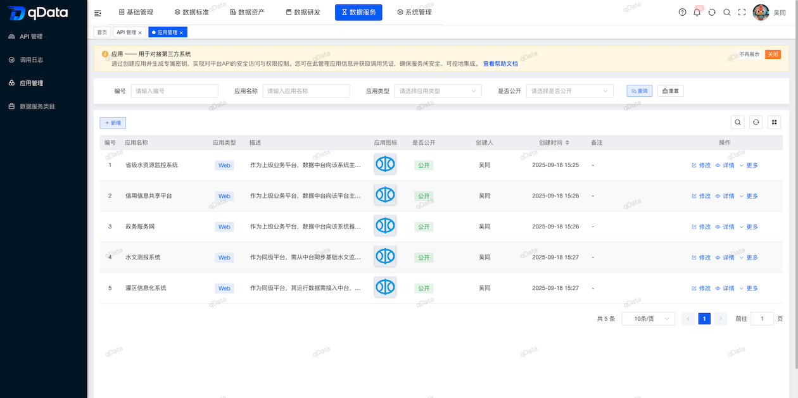</td>
    </tr>
</table>
